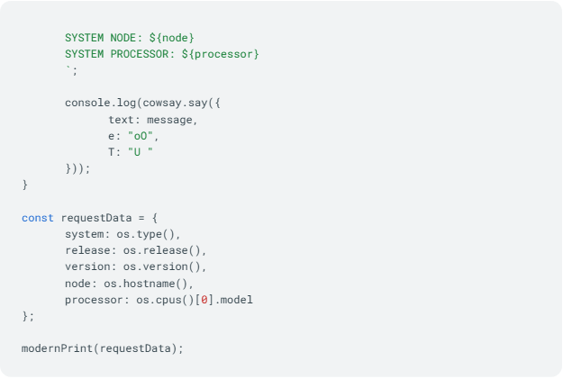

Docker & Cloud Tech  
12.06.25  

### <a id="s6" style="color: #008000">Домашнее задание 3</a>    

Создать Dockerfile для запуска JavaScript-приложения, которое использует 
библиотеку `cowsay` для вывода информации о системе. Пришлите готовый Dockerfile.

1. Создать директорию для проекта.
2. Сохранить исходный код приложения в файл app.js.
3. Создать файл package.json для указания зависимостей проекта и добавить 
в него cowsay.
4. Создать файл Dockerfile.
5. Использовать официальный образ Node.js в качестве базового 
(например, node:18-slim).
6. Установить зависимости при помощи команды в Dockerfile 
(не забываем скопировать app.js и package.json, используя COPY).

Выполнить установку зависимостей в Dockerfile:
```
RUN npm install --only=production
```
Использовать команду для запуска приложения в Dockerfile:
```
CMD ["npm", "start"]
``` 


<a id="img1" style="margin: 40px; color:#808080;">Fig. 1 - Код приложения: app.js, часть 1.</a>



<a id="img2" style="margin: 40px; color:#808080;">Fig. 2 - Код приложения: app.js, часть 2.</a>


<a id="img3" style="margin: 40px; color:#808080;">Fig. 3 - Код файла package.json.</a>
<div style="font: bold normal 110% sans-serif; color: #8A2BE2; white-space: pre; border-top: 2px dotted #008000; padding: 5px;"></div>  


### <a id="s1" style="color: #008000">1. Создать директорию для проекта</a>
Docker/hw03-node
<div style="font: bold normal 110% sans-serif; color: #8A2BE2; white-space: pre; border-top: 2px dotted #008000; padding: 5px;"></div>  


### <a id="s2" style="color: #008000">2. Сохранить исходный код приложения в файл app.js</a>
На рисунках к ДЗ весь код.
<div style="font: bold normal 110% sans-serif; color: #8A2BE2; white-space: pre; border-top: 2px dotted #008000; padding: 5px;"></div>  


### <a id="s3" style="color: #008000">3. Создать файл</a> <a>package.json</a>
В этом файле прописываются  зависимости проекта.
Так же в него нужно добавить <a>cowsay</a>.
<div style="font: bold normal 110% sans-serif; color: #8A2BE2; white-space: pre; border-top: 2px dotted #008000; padding: 5px;"></div>  


### <a id="s4" style="color: #008000">4. Создать файл Dockerfile</a>
Просто скопировала из презентации <span style="color:#808080;">Docker_WD_4 (1).pdf, слайд 68</span>.
<div style="font: bold normal 110% sans-serif; color: #8A2BE2; white-space: pre; border-top: 2px dotted #008000; padding: 5px;"></div>  


### <a id="s5" style="color: #008000">5. Использовать официальный образ Node.js в качестве базового</a>
Например, node:18-slim.  
<div style="font: bold normal 110% sans-serif; color: #8A2BE2; white-space: pre; border-top: 2px dotted #008000; padding: 5px;"></div>  

 

### <a id="s6" style="color: #008000">6. Установить зависимости в Dockerfile</a>
Скопировать app.js и package.json, используя COPY. 
Смотри <span style="color: #808080">[[п. 4](#s4)]</span>, где расписано, откуда взять код.  

<div style="font: bold normal 110% sans-serif; color: #8A2BE2; white-space: pre; border-top: 2px dotted #008000; padding: 5px;"></div>  


 
### <a id="s7" style="color: #008000">7. Сборка и Запуск контейнера</a>
Скопировать из презентации <span style="color:#808080;">Docker_WD_4 (1).pdf, слайд 69</span>.  

В терминале перейти в папку с Dockerfile:
```
cd Docker/hw03-node
```
Для сборки контейнера в консоли / терминале ввести команду:
```
docker build -t node-cowsay-app .
```
Для запуска контейнера в консоли / терминале ввести команду:
```
docker run --rm node-cowsay-app
```
--rm - этот флаг удалит контейнер сразу после выполнения кода в нем. 

<div style="font: bold normal 110% sans-serif; color: #8A2BE2; white-space: pre; border-top: 2px dotted #008000; padding: 5px;"></div>  


<p>
<div style="font: bold normal 110% sans-serif; color: #8A2BE2; white-space: pre; border: 2px outset #8A2BE2; padding: 5px;">        ОТЧЕТ</div>  
<p>
  

<a id="img4" style="margin: 40px; color:#808080;">Fig. 4 - Создание образа.</a>  

  

<a id="img5" style="margin: 40px; color:#808080;">Fig. 5 - Образ в Docker-desktop.</a>  

  

<a id="img6" style="margin: 40px; color:#808080;">Fig. 6 - Отсутствие контейнера в Docker-desktop.</a>  

Потому что есть флаг --rm, который удаляет контейнер сразу после выполнения.  

  

<a id="img7" style="margin: 40px; color:#808080;">Fig. 7 - Результат работы кода из файла app.js в контейнере.</a>  

<div style="font: bold normal 110% sans-serif; color: #8A2BE2; white-space: pre; border-top: 2px dotted #8A2BE2; padding: 5px;"></div>
