Docker & Cloud Tech, Viktor Veretennikov (________________)  
04.07.2025

### <div style="color: #008000">Домашнее задание 4: Docker: Multistage dockerfiles, hw04_docker_compose</div>    
Создайте  многоконтейнерное приложение с помощью Docker Compose, которое состоит из: 
- веб-сервера Nginx, 
- базы данных Redis, 
- базы данных MySQL с volume для хранения файлов БД.

1. Написать <a>hw04_docker_compose.yml</a> файл для запуска нескольких сервисов: Nginx, Redis и MySQL.
2. Настроить volume  mysql_data для хранения данных базы данных MySQL.
3. services: Определение сервисов.
   - web:
     - image: Используемый образ, в данном случае nginx:latest, это официальный образ Nginx.
     - ports: Проброс порта 8080 на порт 80 контейнера.
   - redis:
     - image: redis:latest, это официальный образ Redis.
   - mysql:
     - image: Используемый образ mysql:8.0
     - environment: Переменные окружения для настройки базы данных MySQL.
     - volumes: mysql_data для хранения данных базы данных MySQL.
4. networks: Определение сети.
   - mynetwork: Сеть, которая соединяет все контейнеры.


<div style="font: bold normal 110% sans-serif; color: #8A2BE2; white-space: pre; border-top: 2px dotted #008000; padding: 5px;"></div>  

### <span style="color: #008000">Источники</span>  
<span style="color: #606060">Видео - урок от 17.06.2025</span> [<fodont color="#696969">[1 - ▶  Video 4]</font>](#v1).  
1. ▶ Video 4 "Docker: Multistage dockerfiles, hw04_docker_compose" (17.06.2025): <a id="v1">https://player.vimeo.com/video/1094014398?h=50a6d2259c.</a>    
2. Presentation <a id="p1">Docker_WD_4 (1)-Multistage dockerfiles _ Docker compose - 17_06.pdf</a>  
3. Conspectus <a id="c1">Docker_WD_LfS4-Multistage dockerfiles _ Docker compose - 17_06.pdf</a>  
4. Примеры в <a id="c1">Les_04</a>.
5. Пример решения <a id="p2">Docker_WD_5-20_06.pdf</a>.
6. Руководство по оформлению Markdown файлов: https://gist.github.com/Jekins/2bf2d0638163f1294637.


<div style="font: bold normal 110% sans-serif; color: #8A2BE2; white-space: pre; border: 2px outset #8A2BE2; margin: 60px 0 40px 0; padding: 5px 0 5px 25px;">ДЕЙСТВИЯ</div>

1. Запустить Docker Desktop: или приложение из ярлыка, или развернуть из трея.  
И в терминале `PyCharm` перейти в папку с "docker_compose.yml":
```shell
  cd Docker/hw04_dock_compose_yaml
```

2. Выполнить команду в терминале для сборки образа (см. [<font color="#696969">[3, слайд 48]</font>](#p1)):  
-f  - ключ, потому что файл ЗАДАН с расширением yml.
```shell
  docker compose -f hw04_docker_compose.yml build
```

3. Проверка размера images ([Дополнительные характеристики образа](https://chatgpt.com/s/t_686e7e80a6788191836857529c3481d5)): 
```shell
  docker images
  #  или (то же самое):
  docker image ls
  # Дополнительные характеристики для конкретного образа (например, mysql:8.0):
  docker image inspect mysql:8.0

```

4. Запуск Docker Compose - запустить контейнеры (сервисы), описанные в hw04_docker_compose.yml и входящие 
в состав приложения (см. [<font color="#696969">[3, слайд 46]</font>](#p1)):
```shell
  docker compose -f hw04_docker_compose.yml up
```

5. После запуска можно увидеть статус, выполнив команду в терминале:
```shell
  docker ps
```

6. Просмотреть созданные файлы:
```shell
  # В bash:
  # ls -la
  
  # В Пайчарме:
  ls Docker/hw04_dock_compose_yaml
```

7. Просмотреть занятое место ДОКЕРНЫМИ сущностями на диске:
```shell
  docker system df
```

8. Открыть приложение в браузере по адресу: 
   ```
   http://localhost:8080
   ```

9. Просмотр логов для проверки работы всех приложений в docker (см. [<font color="#696969">[3, слайд 49]</font>](#p1), 
["3. Следить за логами в реальном времени"](https://chatgpt.com/s/t_686e6ea5485c8191846b8f9318cc54ac),
[Посмотреть логи, если docker-compose.yml в подпапке](https://chatgpt.com/s/t_686e83ff0f488191bebefab4f5fa9f78)):
```shell
  # Вариант 1 — перейти в нужную папку:
  cd Docker/hw04_dock_compose_yaml
  docker compose logs
  # или docker-compose logs в старом синтаксисе - с ДЕФИСОМ.
  
  # Логи конкретного приложения:
  docker compose logs mysql
  docker compose logs redis
  docker compose logs web

  # -------------------------------
  # Вариант 2 — задать путь к compose-файлу:
  docker compose -f Docker/hw04_dock_compose_yaml/hw04_docker_compose.yml logs
  # Или для конкретного приложения:
  docker compose -f Docker/hw04_dock_compose_yaml/hw04_docker_compose.yml logs web  
```

10. Остановить работающий контейнер (см. [<font color="#696969">[3, слайд 47, 51]</font>](#p1)):  
- или через Docker Desktop,
- просто в терминале 2-жды нажать Ctrl+C (Gracefully stopping... (press Ctrl+C again to force)),
- или через команду во 2-м терминале:
```shell
   docker compose -f Docker/hw04_dock_compose_yaml/hw04_docker_compose.yml stop
  # ИЛИ
  # docker-compose down
```

11. Проверить и в терминале тоже, что контейнеры остановлены, для чего просмотреть 
список ВСЕХ контейнеров, включая остановленные ([1. Показать ВСЕ контейнеры, включая остановленные](https://chatgpt.com/s/t_686e8c0273e48191b6b2d640ad47faa6)):
```shell
  # В bash:
  # docker container ps -al
  
  # В Пайчарме:
  docker ps -a
  # Показать только запущенные контейнеры:
  docker ps
```

12. Удалить контейнеры или в Докер Десктоп или в терминале ([Удаление остановленного контейнера](https://chatgpt.com/s/t_686e8f8f530c8191b8067ff5648e4beb)):
```shell
  # Сначала проверить занятое место на диске:
  docker system df

  # Удалить один конкретный остановленный контейнер по имени:
  docker rm hw04_dock_compose_yaml-web-1
  # Удалить один конкретный остановленный контейнер по ID:
  docker rm f40d90a392bc

  # Удалить все остановленные контейнеры:
  docker container prune

```

13. Удалить образ/ы ([Как правильно удалить образы Docker](https://chatgpt.com/s/t_686e947827c08191b0297105a8d1135c)):  
- или через Docker Desktop,
- или через команду в терминале:
```shell
  # Посмотреть список всех образов:
  docker images

  # Удалить конкретный образ по имени:
  docker image rm nginx:latest
  # или так:
  docker rmi nginx:latest
  # Удалить конкретный образ по ID:
  docker rmi 2bcb04bdb83f

  # Удалить все неиспользуемые (dangling) образы:
  docker image prune  # удалит только неиспользуемые и безымянные образы (без репозитория/тэга).
  
  # Удалить ВСЕ неиспользуемые ресурсы - мощная команда для генеральной уборки:
  docker system prune   # ОПАСНО!!!


```

14. Почистить кеш:
```shell
  # Просмотреть занятое место на диске:
  docker system df
  # Удалить кеш:
  docker builder prune
```

Если нужно удалить поднятую БД "db-data" со всеми вложенными папками, то можно сделать удаление 
через терминал VOLUMES:
```shell
  # Посмотреть список volume'ов:
   docker volume ls
  
  # Удалить volume: 
  docker volume rm db_data
  
  # удалить все неиспользуемые volume'ы:
  docker volume prune

  
  # Удалить папку в bash:
  # rm -rf db-data/
```


Далее подробно по каждому шагу.


<div style="font: bold normal 110% sans-serif; color: #8A2BE2; white-space: pre; border-top: 2px dotted #008000; padding: 5px; margin: 40px 0 40px 0"></div>

## <a id="s1" style="color: #008000">1. Docker Desktop</a>  

<div style="margin: 20px 20px 20px 0;">
<b style="color: #F00000; border: 2px solid #6B0000; padding: 10px; margin: 10px 10px 10px 0;"> NB ! </b>
Сначала <span style="color: red">ЗАПУСТИТЬ</span> 
 
<span style="font: bold 130% sans-serif; color: deepskyblue; background: black; padding: 5px;">Docker Desktop!</span>
</div>


<div style="font: bold normal 110% sans-serif; color: #8A2BE2; white-space: pre; border-top: 2px dotted #008000; padding: 5px; margin: 40px 0 40px 0"></div>

## <a id="s2" style="color: #008000">2. Файл <span style="color: royalblue;">hw04_docker_compose.yml</span> для запуска сервисов: Nginx, Redis и MySQL</a>  
Пример решения см. [<font color="#696969">[5, слайд 102]</font>](#p2).  
Пример полного разбора docker-compose файла  см. [<font color="#696969">[3, с. 16]</font>](#c1).

__YAML__ (.yml) — популярный <font style="color: #8A2BE2; padding: 0 5px 0 0;">__язык__</font> для 
<font style="color: #8A2BE2; padding: 0 5px 0 0;">__конфигурационных файлов__</font>, который используется 
для сериализации данных ([YAML за 5 минут](https://tproger.ru/translations/yaml-za-5-minut-sintaksis-i-osnovnye-vozmozhnosti)), 
а так же широко используемый DevOps  в подходе "Инфраструктура как Код" (IaC). 
Несмотря на то, что работать с ним бывает проще, чем с тем же JSON (особенно в контексте взаимодействия с 
большими объемами данных), иногда использовать его бывает трудно
([Сборник советов, как упростить работу с YAML-файлами](https://habr.com/ru/companies/itsumma/articles/796887/)).


### <a id="s2.1" style="color: #008000">2.1. web --> Nginx</a>
<div style="margin: 0 0 0 20px">
<span style="font: small-caps 120% sans-serif; color: #8A2BE2; padding: 0 5px 0 0;">▣ &nbsp;&nbsp; Nginx</span> - это:  

<ul style="margin: 0 0 0 20px;  list-style: square;"> 
<li style="color: #8A2BE2"> <span style="color: darkgray">высокопроизводительный веб-сервер,</span></li>
<li style="color: #8A2BE2"> <span style="color: darkgray">обратный прокси-сервер,</span></li>
<li style="color: #8A2BE2"> <span style="color: darkgray">почтовый прокси-сервер,</span></li>
<li style="color: #8A2BE2"> <span style="color: darkgray">балансировщик нагрузки.</span></li>
</ul>

Используется для доставки статических файлов, обработки запросов, распределения нагрузки между серверами и 
повышения производительности веб-сайтов
([Что такое nginx и...](https://www.nic.ru/help/chto-takoe-nginx-i-kak-pravil6no-ego-nastroit6_11046.html)).  
<font style="color: #8A2BE2; padding: 0 5px 0 0;">Веб-сервер:</font> Nginx может обслуживать статические файлы 
(HTML, CSS, JavaScript, изображения и т. д.) непосредственно клиентам, что делает его эффективным 
для быстрой доставки контента ([Деплой приложения с nginx](https://selectel.ru/blog/tutorials/deploy-with-nginx/#:~:text=Nginx%20%E2%80%94%20%D1%8D%D1%82%D0%BE%20%D0%B2%D0%B5%D0%B1%2D%D1%81%D0%B5%D1%80%D0%B2%D0%B5%D1%80%2C,%D0%BA%D0%B0%D1%87%D0%B5%D1%81%D1%82%D0%B2%D0%B5%20%D0%B0%D0%BB%D1%8C%D1%82%D0%B5%D1%80%D0%BD%D0%B0%D1%82%D0%B8%D0%B2%D1%8B%20%D0%BC%D0%BE%D0%B6%D0%BD%D0%BE%20%D0%BF%D1%80%D0%B8%D0%B2%D0%B5%D1%81%D1%82%D0%B8%20Apache.), 
[Веб-серверы Apache и Nginx](https://www.ispmanager.ru/news/veb-servery-apache-i-nginx)).  
<font style="color: #8A2BE2; padding: 0 5px 0 0;">Обратный прокси:</font> Nginx может выступать в роли 
обратного прокси, перенаправляя запросы к другим серверам (например, серверам приложений) и 
кэшируя ответы для повышения производительности. Это позволяет отделить логику приложения от обслуживания 
статического контента, улучшить масштабируемость и безопасность.  
<font style="color: #8A2BE2; padding: 0 5px 0 0;">Балансировщик нагрузки:</font> Nginx может распределять трафик 
между несколькими серверами, обеспечивая отказоустойчивость и высокую доступность.  
<font style="color: #8A2BE2; padding: 0 5px 0 0;">Почтовый прокси:</font> Nginx может обрабатывать запросы к 
почтовым серверам, обеспечивая безопасность и оптимизацию работы почтовой инфраструктуры.  
<font style="color: #8A2BE2; padding: 0 5px 0 0;">Высокая производительность:</font> Nginx известен своей 
эффективностью, способностью обрабатывать большое количество одновременных соединений и низким 
потреблением ресурсов, что делает его популярным выбором для высоконагруженных проектов.<br> 
Nginx является универсальным инструментом, который может значительно улучшить производительность и надежность веб-приложений, а также обеспечить эффективную работу различных сетевых сервисов. 
</div>


### <a id="s2.2" style="color: #008000">2.2. redis --> Redis</a>  
<div style="margin: 0 0 0 20px">

<span style="font: small-caps 120% sans-serif; color: #8A2BE2; padding: 0 5px 0 0;">▣ &nbsp;&nbsp; Redis </span>
(Remote Dictionary Service) - это in-memory <font style="color: #8A2BE2; padding: 0 5px 0 0;">хранилище данных</font> 
(сервер баз данных типа ключ-значение) с открытым исходным кодом, которое часто используется для
([Redis Database Basics...](https://www.freecodecamp.org/news/how-to-learn-redis/), [Redis: что это...](https://practicum.yandex.ru/blog/chto-takoe-redis-i-dlya-chego-nuzhen/#:~:text=Redis%20%D0%B8%D1%81%D0%BF%D0%BE%D0%BB%D1%8C%D0%B7%D1%83%D1%8E%D1%82%20%D0%B4%D0%BB%D1%8F%20%D0%BA%D1%8D%D1%88%D0%B8%D1%80%D0%BE%D0%B2%D0%B0%D0%BD%D0%B8%D1%8F%20%D0%B4%D0%B0%D0%BD%D0%BD%D1%8B%D1%85,%D0%B2%20%D0%BC%D0%BE%D0%B1%D0%B8%D0%BB%D1%8C%D0%BD%D1%8B%D1%85%20%D0%BF%D1%80%D0%B8%D0%BB%D0%BE%D0%B6%D0%B5%D0%BD%D0%B8%D1%8F%D1%85%2C%20%D0%B2%20%D0%B8%D0%B3%D1%80%D0%B0%D1%85.&text=%D0%A1%D0%BE%D0%B7%D0%B4%D0%B0%D0%BD%D0%B8%D0%B5%20%D0%BE%D1%87%D0%B5%D1%80%D0%B5%D0%B4%D0%B5%D0%B9%20%D1%81%D0%BE%D0%BE%D0%B1%D1%89%D0%B5%D0%BD%D0%B8%D0%B9.,%D0%BF%D0%BE%D0%B7%D0%B2%D0%BE%D0%BB%D1%8F%D0%B5%D1%82%20%D0%BF%D1%80%D0%B8%D0%BB%D0%BE%D0%B6%D0%B5%D0%BD%D0%B8%D1%8F%D0%BC%20%D0%B0%D1%81%D0%B8%D0%BD%D1%85%D1%80%D0%BE%D0%BD%D0%BD%D0%BE%20%D0%BE%D0%B1%D1%80%D0%B0%D0%B1%D0%B0%D1%82%D1%8B%D0%B2%D0%B0%D1%82%D1%8C%20%D0%B4%D0%B0%D0%BD%D0%BD%D1%8B%D0%B5.), 
[Redis: What It Is...](https://backendless.com/redis-what-it-is-what-it-does-and-why-you-should-care/), 
[Разбираемся с Redis](https://habr.com/ru/companies/wunderfund/articles/685894/)): 
- кэширования, 
- управления сессиями, 
- очередей сообщений, 
- других задач, требующих быстрой обработки данных.  

Правильное использование Redis предполагает понимание его основных возможностей и ограничений, а также 
правильный выбор стратегии для конкретных задач.  
Redis — это БД, размещаемая в памяти, которая используется, в основном, в роли кеша, находящегося перед другой, 
«настоящей» БД, вроде MySQL или PostgreSQL. Кеш, основанный на Redis, помогает улучшить производительность приложений.  

<font style="color: #8A2BE2; padding: 0 5px 0 0;">Основные принципы использования Redis:</font>  
- Понимание in-memory природы:  
    Redis хранит данные в оперативной памяти, что обеспечивает высокую скорость доступа, но также означает, 
    что данные могут быть потеряны при сбое питания или перезагрузке сервера.  
- Выбор подходящего типа данных:  
    Redis поддерживает различные типы данных, такие как строки, списки, множества, хеши и отсортированные множества. 
    Выбор правильного типа данных может значительно повлиять на производительность и эффективность использования памяти. 
- Использование транзакций:  
    Redis поддерживает транзакции, что позволяет выполнять несколько операций атомарно, обеспечивая целостность данных. 
- Настройка репликации и сохранения данных:  
    Для обеспечения отказоустойчивости и защиты от потери данных рекомендуется настроить репликацию и 
    сохранение данных на диск ([A NoSQL database for high-availability](https://redis.io/technology/highly-available-redis/)). 
- Использование Redis CLI и библиотек:  
    Redis предоставляет командную строку (Redis CLI) для управления и взаимодействия с сервером, а также 
    клиентские библиотеки для различных языков программирования ([Redis Database Basics...](https://www.freecodecamp.org/news/how-to-learn-redis/)).
</div>


### <a id="s2.3" style="color: #008000">2.3. Docker Healthcheck</a>  
Вставляется после `depends_on:` (см. [<font color="#696969">[1 - ▶  Video 4, 3:11:45]</font>](#v1)).
<div style="margin: 0 0 0 20px">

<span style="font: small-caps 120% sans-serif; color: #8A2BE2; padding: 0 5px 0 0;">▣ &nbsp;&nbsp; Healthcheck </span> -
механизм, который позволяет автоматически проверять, "жив" ли контейнер, например:  
- Поднялся ли MySQL и готов ли к соединениям?
- Отвечает ли Redis?
- Возвращает ли nginx код 200?

Если проверка не проходит, Docker может пометить контейнер как "unhealthy", и другие сервисы 
(или человек) узнают, что он ещё не готов ([ChatGPT](https://chatgpt.com/s/t_686e18162f648191a4affa661af707c7)).
</div>


<div style="font: bold normal 110% sans-serif; color: #8A2BE2; white-space: pre; border-top: 2px dotted #008000; padding: 5px; margin: 40px 0 40px 0"></div>

## <a id="s2" style="color: #008000">2. Как это работает на практике:</a>  

### <a id="ss2.1" style="color: #008000">2.1. Контейнерная архитектура:</a>

| Сервис  | Образ       | Функция       | Порты     | Сеть      | Хранилище    |
| ------- | ----------- | ------------- | --------- | --------- | ------------ |
| `web`   | `nginx`     | HTTP-сервер   | `8080:80` | mynetwork | —            |
| `redis` | `redis`     | Кэш и очередь | —         | mynetwork | —            |
| `mysql` | `mysql:8.0` | База данных   | —         | mynetwork | `mysql_data` |


### <a id="ss2.2" style="color: #008000">2.2. Файл `hw04_docker_compose.yml`</a>

| Элемент                 | Значение                                                                       |
| ----------------------- | ------------------------------------------------------------------------------ |
| `version: '3.8'`        | Версия формата файла. `3.8` совместима с Docker 19.03+                         |
| `services:`             | Определяет список контейнеров                                                  |
| `web:`                  | Контейнер с Nginx                                                              |
| `ports: - "8080:80"`    | Порт 80 внутри контейнера (Nginx) будет доступен снаружи по порту 8080         |
| `redis:`                | Контейнер с Redis                                                              |
| `networks: - mynetwork` | Оба контейнера подключены к **одной сети**, что позволяет им общаться по имени |

1. Когда через команду в терминале запускается `hw04_docker_compose up`, создаются 3 контейнера:

   * `web` с Nginx,
   * `redis` с Redis,
   * `mysql` с MySQL.

2. Docker также автоматически создаёт сеть `mynetwork`, если она не описана отдельно. 
Она будет _изолированной_ (`bridge`), но _общая_ для всех 3-х сервисов.

3. Контейнеры смогут "видеть" друг друга (общаться) по внутренним DNS-именам:

   * Внутри `web` можно обратиться к Redis так:
     `redis:6379`
   * Внутри `web` можно обратиться к базе:
     `mysql:3306`
   * Внутри `redis` — к Nginx:
     `web:80`

4. Последний блок `networks:` (в конце `hw04_docker_compose.yml`) *явно определяет сеть*, 
что рекомендуется для читаемости и контроля.

5. Если в браузере перейти по адресу:
   ```
   http://localhost:8080
   ```
   — то откроется стартовая страница Nginx внутри контейнера.


<div style="font: bold normal 110% sans-serif; color: #8A2BE2; white-space: pre; border-top: 2px dotted #008000; padding: 5px; margin: 40px 0 40px 0"></div>

## <a id="s3" style="color: #008000">3. РЕЗУЛЬТАТЫ</a>  

### <a id="ss3.1" style="color: #008000">3.1. Запустить Docker Desktop</a>

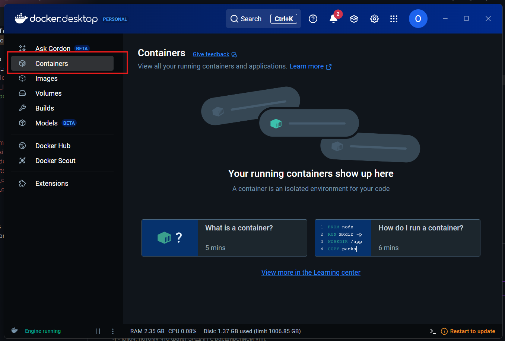  

<a id="img1" style="margin: 0 0 0 40px; color:#606060;">Fig. 1. Запущенный Docker Desktop: Containers.</a>

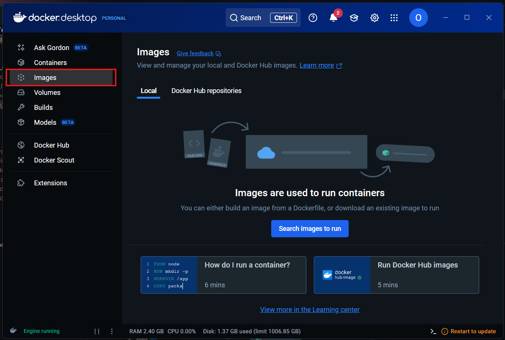  

<a id="img2" style="margin: 0 0 0 40px; color:#606060;">Fig. 2. Запущенный Docker Desktop: Images.</a>

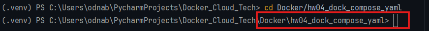  

<a id="img3" style="margin: 0 0 0 40px; color:#606060;">Fig. 3. Переход в папку с "docker_compose.yml"-файлом.</a>


### <a id="ss3.2" style="color: #008000">3.2. и 3.4. Сборка образа и Запуск контейнеров <br> (пункты 2 и 4 объединены в одну команду)</a>

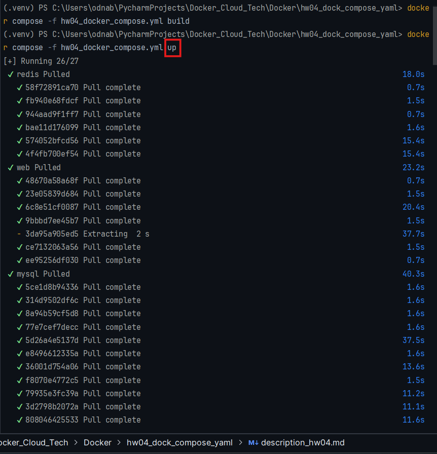  

<a id="img4" style="margin: 0 0 0 40px; color:#606060;">Fig. 4. Процесс СБОРКИ.</a>

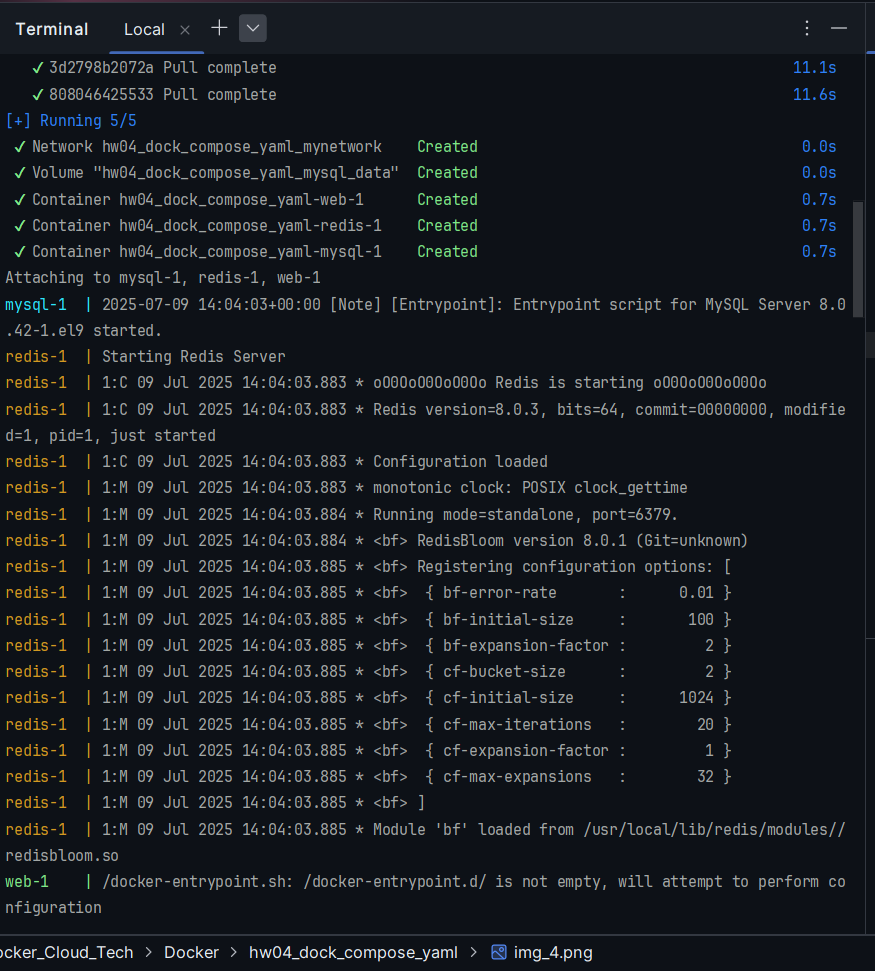  

<a id="img5" style="margin: 0 0 0 40px; color:#606060;">Fig. 5. Процесс ЗАПУСКА.</a>

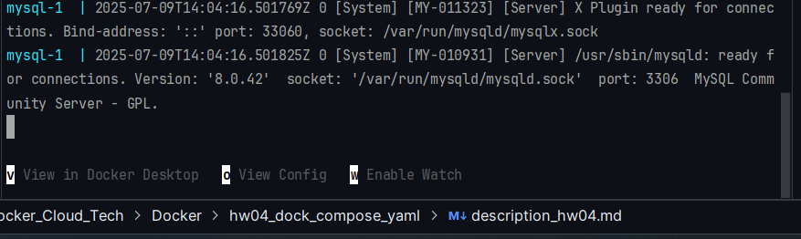  

<a id="img6" style="margin: 0 0 0 40px; color:#606060;">Fig. 6. Окончание процесса запуска.</a>

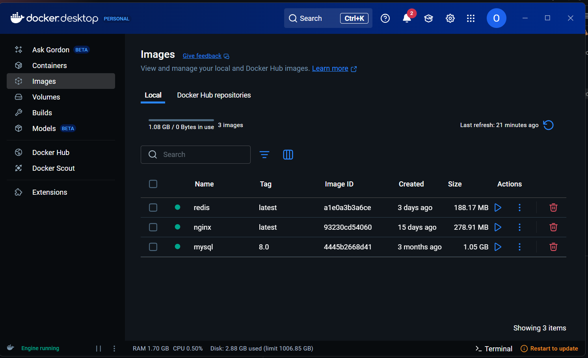  

<a id="img7" style="margin: 0 0 0 40px; color:#606060;">Fig. 7. Собранные образы в Докер Десктоп.</a>

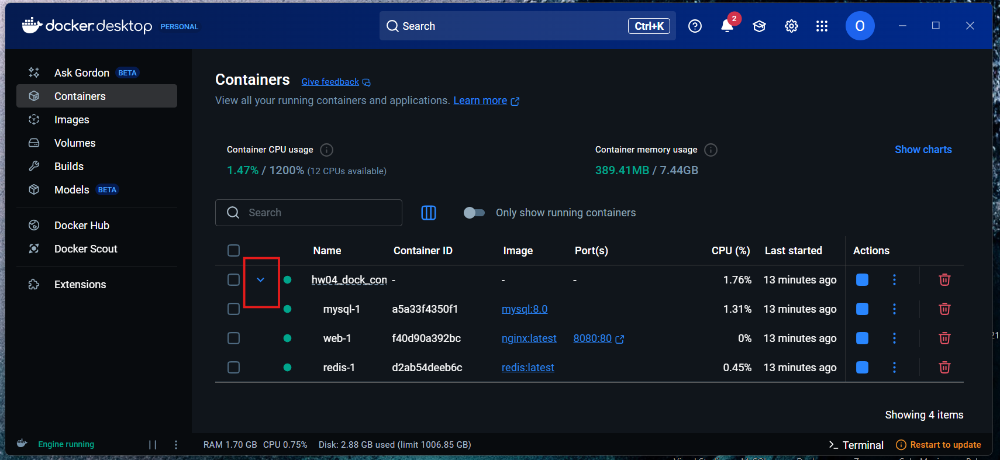  

<a id="img8" style="margin: 0 0 0 40px; color:#606060;">Fig. 8. Запущенные контейнеры в Докер Десктоп.</a>


### <a id="ss3.3" style="color: #008000">3.3. и 3.5. Просмотр размера images и статуса</a>

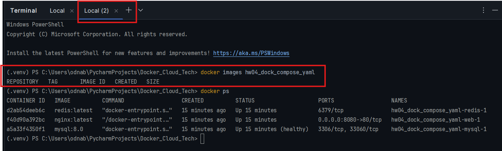  

<a id="img9" style="margin: 0 0 0 40px; color:#606060;">Fig. 9. НЕ отработавшая команда 
`docker images hw04_dock_compose_yaml` и результат команды `docker ps`.</a>

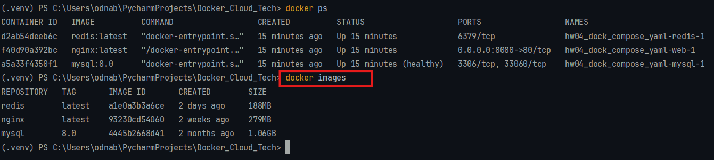  

<a id="img10" style="margin: 0 0 0 40px; color:#606060;">Fig. 10. Правильно введенная команда `docker images`.</a>

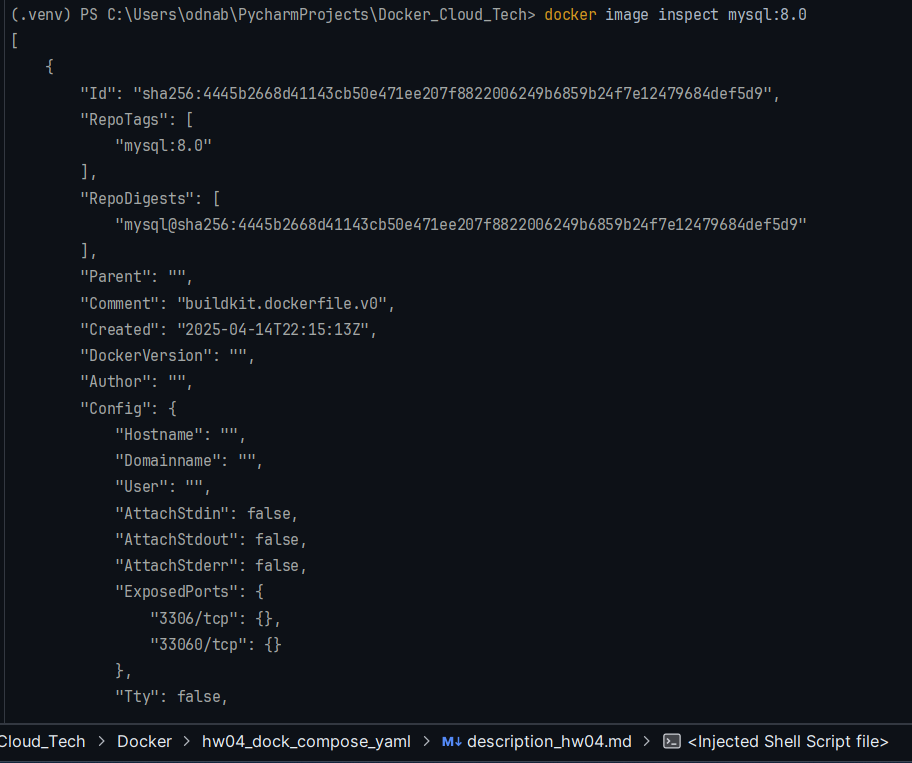  

<a id="img11" style="margin: 0 0 0 40px; color:#606060;">Fig. 11. Дополнительные характеристики для конкретного образа.</a>


### <a id="ss3.6" style="color: #008000">3.6. Просмотреть созданные файлы</a>

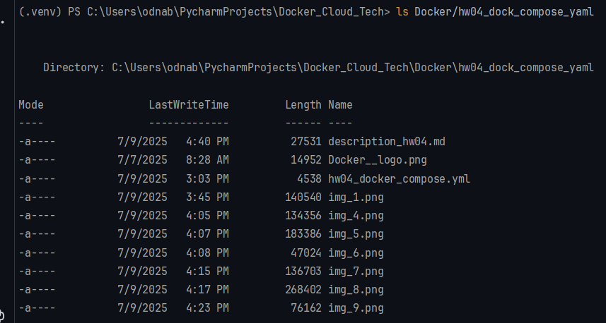  

<a id="img12" style="margin: 0 0 0 40px; color:#606060;">Fig. 12. Созданные файлы.</a>


### <a id="ss3.7" style="color: #008000">3.7. Занятое место ДОКЕРНЫМИ сущностями на диске</a>

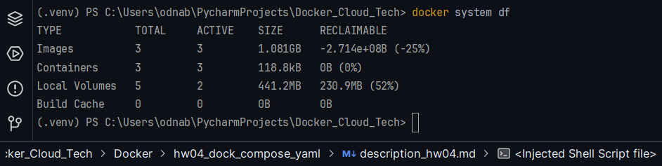  

<a id="img13" style="margin: 0 0 0 40px; color:#606060;">Fig. 13. Занятое место ДОКЕРНЫМИ сущностями.</a>

### <a id="ss3.8" style="color: #008000">3.8. Вид приложения в браузере по адресу</a>

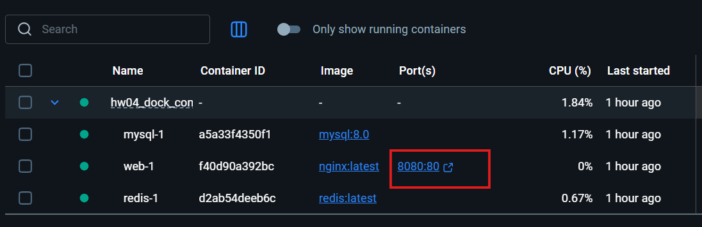  

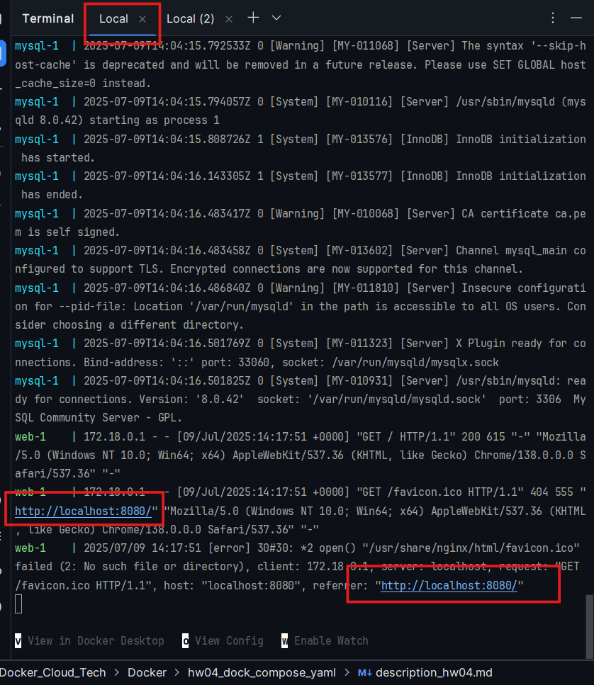  

<a id="img14" style="margin: 0 0 0 40px; color:#606060;">Fig. 14. Или в Докер Десктоп перейти по ссылке, или
перейти по ссылке из терминала в Пайчарме.</a>

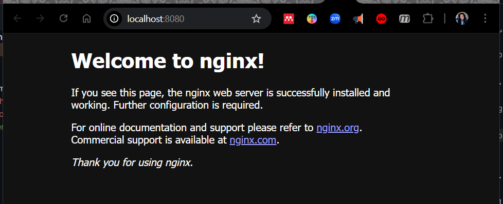  

<a id="img15" style="margin: 0 0 0 40px; color:#606060;">Fig. 15. http://localhost:8080.</a>


### <a id="ss3.9" style="color: #008000">3.9. Просмотр логов</a>

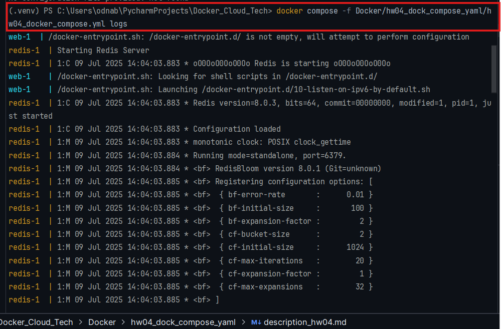  

<a id="img16" style="margin: 0 0 0 40px; color:#606060;">Fig. 16. Логи всех приложений в Пайчарм.</a>

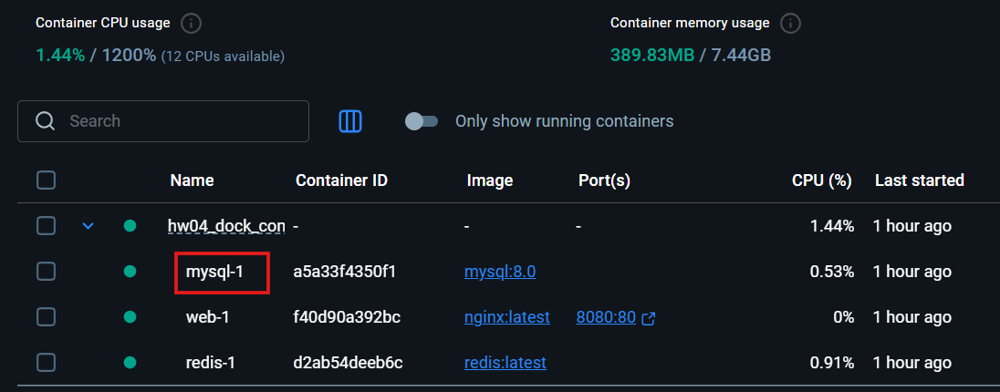  

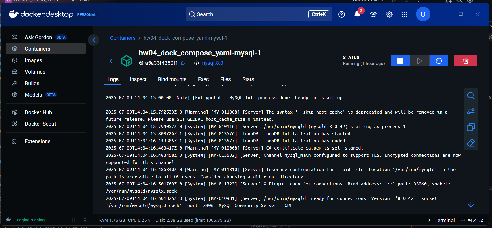  

<a id="img17" style="margin: 0 0 0 40px; color:#606060;">Fig. 17. Логи приложения mysql в Докер Десктоп.</a>


### <a id="ss3.10" style="color: #008000">3.10. Остановить работающий контейнер</a>

  

<a id="img18" style="margin: 0 0 0 40px; color:#606060;">Fig. 18. Остановить контейнер в Пайчарм.</a>


### <a id="ss3.11" style="color: #008000">3.11. Проверить, что контейнеры остановлены</a>

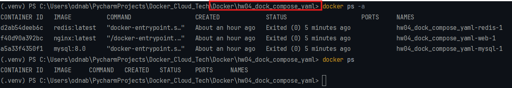  

<a id="img19" style="margin: 0 0 0 40px; color:#606060;">Fig. 19. ВСЕ контейнеры, включая остановленные и 
активные контейнеры. При этом нужно оставаться внутри директории приложения.</a>

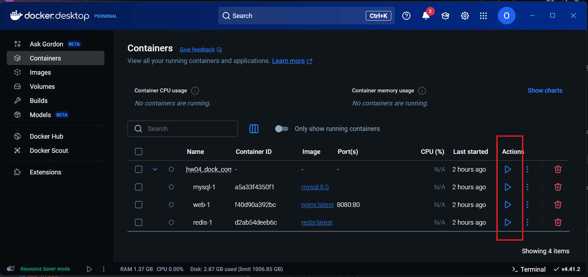  

<a id="img20" style="margin: 0 0 0 40px; color:#606060;">Fig. 20. Состояние контейнеров в Докер Десктоп.</a>


### <a id="ss3.12" style="color: #008000">3.12. Удалить контейнеры</a>

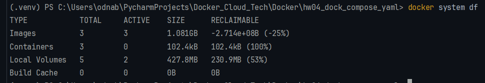  

<a id="img21" style="margin: 0 0 0 40px; color:#606060;">Fig. 21. Занятое место на диске.</a>

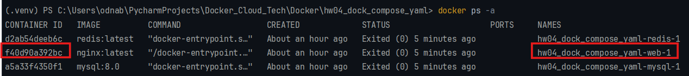  

<a id="img22" style="margin: 0 0 0 40px; color:#606060;">Fig. 22. Имя и ID контейнера для удаления.</a>

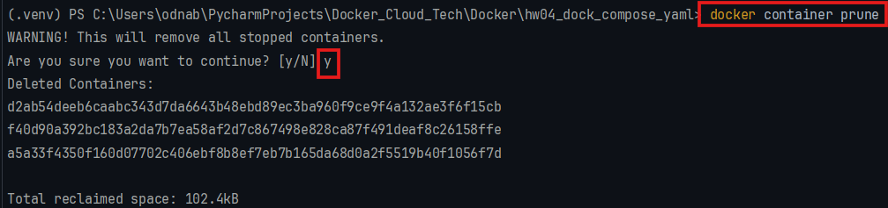  

<a id="img23" style="margin: 0 0 0 40px; color:#606060;">Fig. 23. Результат удаления контейнеров в терминале Пайчарм.</a>

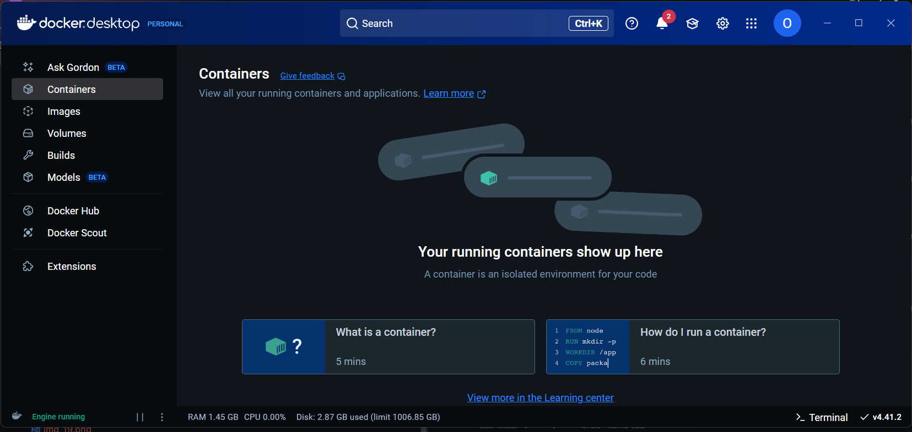  

<a id="img24" style="margin: 0 0 0 40px; color:#606060;">Fig. 24. Результат удаления контейнеров в Докер Десктоп.</a>

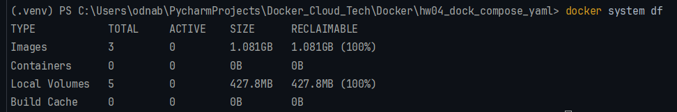  

<a id="img25" style="margin: 0 0 0 40px; color:#606060;">Fig. 25. Результат в системе после удаления контейнеров.</a>


### <a id="ss3.13" style="color: #008000">3.13. Удалить образ</a>

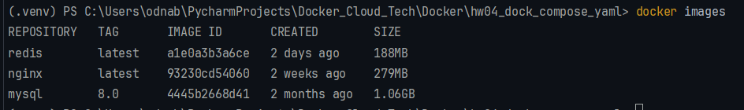  

<a id="img26" style="margin: 0 0 0 40px; color:#606060;">Fig. 26. Список всех образов.</a>

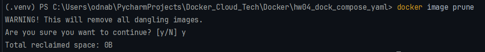  

<a id="img27" style="margin: 0 0 0 40px; color:#606060;">Fig. 27. Результат удаления образов 
по команде "docker image prune" - НЕ ОТРАБОТАЛО!!!.</a>

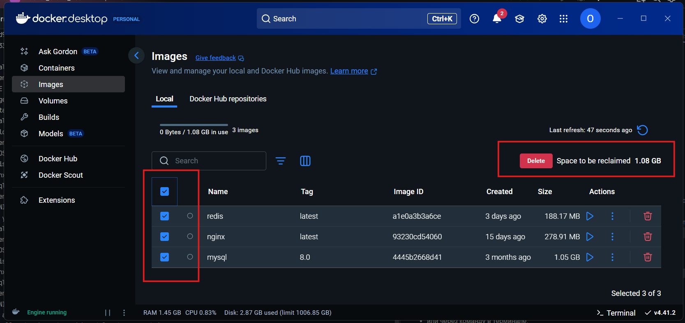  

<a id="img28" style="margin: 0 0 0 40px; color:#606060;">Fig. 28. Результат удаления образов 
в Докер Десктоп.</a>


### <a id="ss3.14" style="color: #008000">3.14. Почистить кеш</a>

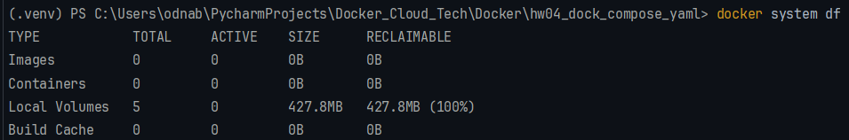  

<a id="img29" style="margin: 0 0 0 40px; color:#606060;">Fig. 29. Занятое место на диске.</a>

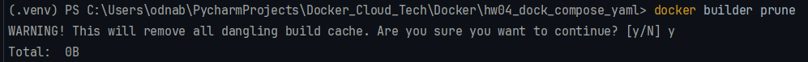  

<a id="img30" style="margin: 0 0 0 40px; color:#606060;">Fig. 30. Странно! Удалять было нечего из Кеша
Такое впечатление, что КЕШ почистился вместе с удалением образов в Докер Десктоп.</a>


<div style="font: bold normal 110% sans-serif; color: #8A2BE2; white-space: pre; border-top: 2px dotted #008000; padding: 5px;"></div>  

## <a id="s4" style="color: #008000">4. GitHub</a>
Ссылка на комментарии по ДЗ <a>description_hw04.md</a> со скриншотами: .  

Ссылка на папку с ДЗ <a>HW_07</a>: .  

---
<div style="font: bold normal 110% sans-serif; color: #8A2BE2; white-space: pre; border-top: 2px dotted #8A2BE2; padding: 5px; margin: 40px 0 40px 0"></div>

[//]: # (Строка с отступами сверху и снизу --- <div style="margin: 40px 0 40px 0">Текст</div>)

[//]: # (Подзаголовок Фиол--- <div style="font: small-caps 120% sans-serif; color: #8A2BE2; padding: 0 15px 0 0;">▣ &nbsp;&nbsp; Выполните запросы:</div>  )

[//]: # (ссылка на источник --- [<font color="#696969">[1 ▶ V-13, \__:__]</font>]\(#__\).  )

[//]: # (<span style="color: #8A2BE2; margin: 20px 40px; padding: 5px; background: #000000;">▣ ⚜️ ☑️ ✔️ 🟪 ■ ※ ⁂ ⁙ ⁘ ⨠  ■ ◲◳ ◆ ◇ ◈ ◀ ▶ ◁ ▷ ▹ ▼ ▲ ▽ △ ▢ ₪₪₪</span>  ) 

[//]: # (🔷🔹 🟩 ❇️♾️⚜️✳️❎✅☑️✔️🟪🔳🔲  )
[//]: # (■ ⁜ ※ ⁂ ⁙ ⁘ ⫷ ⫸ ⩕ ⨠ ⨝ ⋘ ⋙ ∵ ∴ ∶ ∷ ■ ◪ ◩ ◲ ◳ ◆ ◇ ◈ ▼ ▽ ◀ ▶ ◁ ▷ ▹ ▲ △ ▢ ₪₪₪  )


[//]: # (NB! --- <div style="color: #F00000; margin: 40px 20px 20px 0;">)

[//]: # (<span style="border: 2px solid #6B0000; padding: 10px;"> NB ! </span>)

[//]: # (</div>)


[//]: # (Пробел  ---  &nbsp;&nbsp; spaces)

[//]: # (Линия-разделитель с отступами --- <div style="font: bold normal 110% sans-serif; color: #8A2BE2; white-space: pre; border-top: 2px dotted #008000; padding: 5px;"></div>)
